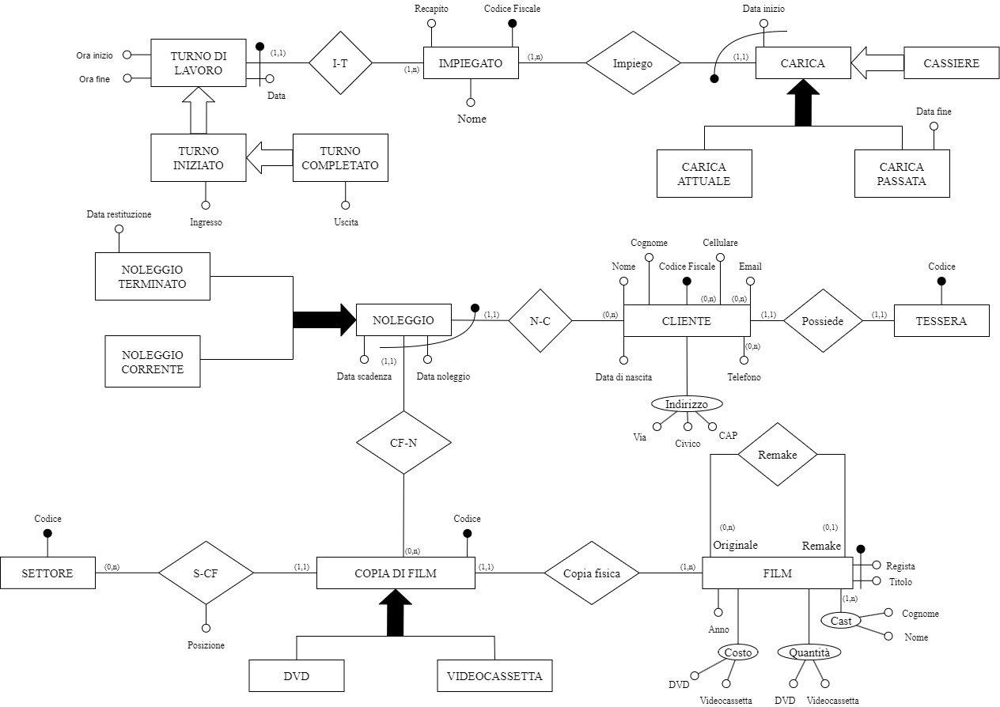
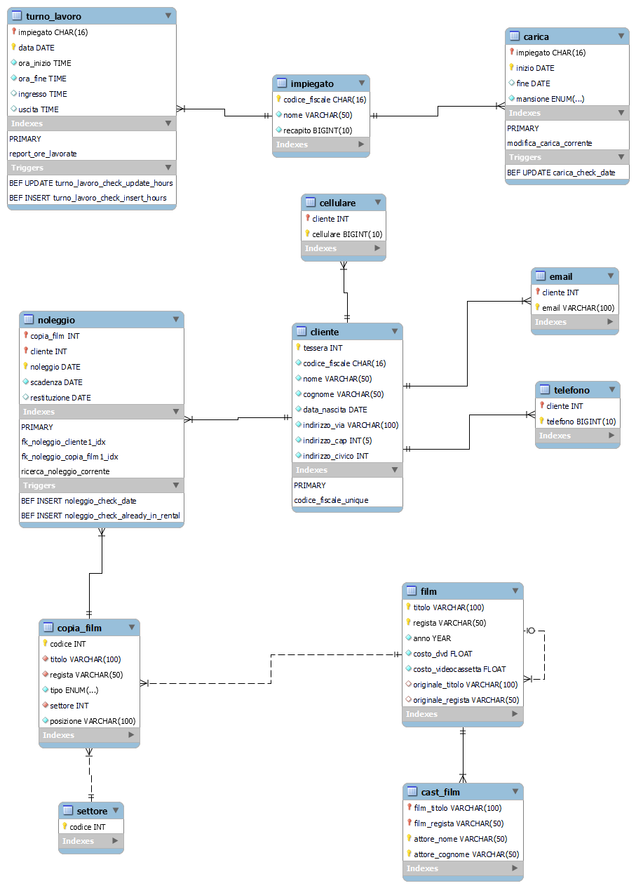

# sistema-noleggio-film
Repository per lo sviluppo del progetto di Basi di Dati (a.a. 2023/2024) presso l'università di Tor Vergata - autor3: Francesco Masci

## Specifiche di progetto
Questo repository contiene gli artefatti di un progetto per l'implementazione di un database. Partendo da un insieme iniziale di requisiti vaghi, il progetto ha coinvolto un continuo raffinamento delle specifiche, la creazione di modelli concettuali e logici dei dati e lo sviluppo di un'interfaccia thin client basata su Java.

## Schemi del Database

### Schema Concettuale

Lo schema concettuale mostra le entità principali del database e le loro relazioni.

### Schema Logico

Lo schema logico rappresenta la traduzione dello schema concettuale in una struttura relazionale.
